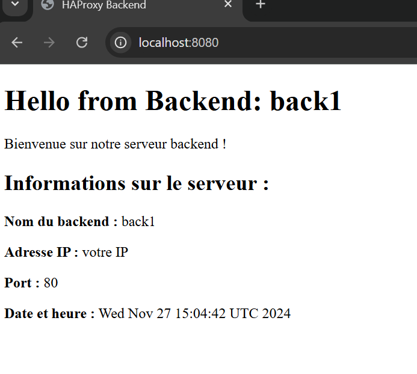
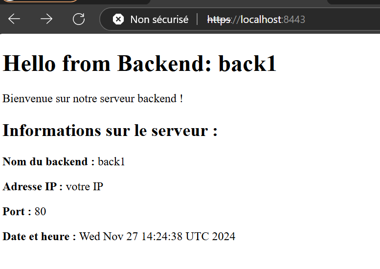
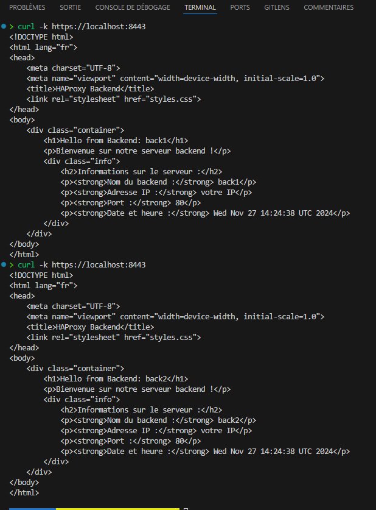
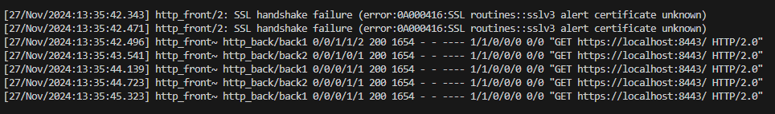
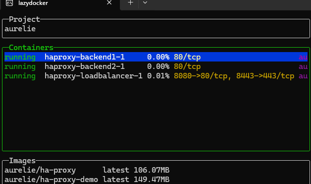

# 🌐 Mini projet personnel HAProxy avec Certificat Auto-Signé

Ce projet configure un load balancer HAProxy avec et sans certificat SSL auto-signé (pour les connexions HTTPS), à des fins d'apprentissage.
Le but étant de switcher entre 2 backends

## Prérequis

- Docker
- Docker Compose
- optionnel : lazydocker

## Configuration

1. **Générer un certificat auto-signé dans le terminal** :

   ```bash
   openssl req -new -newkey rsa:2048 -days 365 -nodes -x509 -keyout haproxy-selfsigned.key -out haproxy-selfsigned.crt

2. **Créer un fichier PEM** :

    ```bash
    cat haproxy-selfsigned.key haproxy-selfsigned.crt > haproxy-selfsigned.pem

3. **Déplacer le fichier PEM dans le répertoire approprié** :

    ```bash
    sudo mkdir -p /etc/haproxy/certs
    sudo mv haproxy-selfsigned.pem /etc/haproxy/certs/

## 🚀 Utilisation

Construire l'image Docker et Démarrer les Services via le Makefile

    make run-local

## Vérifier l'Accès HTTP, puis HTTPS ( testé sur tous navigateurs )

Ouvrir le navigateur web et accéder à http://localhost:8080



Puis, https://localhost:8443. On devrais avoir un avertissement de sécurité en raison du certificat auto-signé ( non reconnu, mais existant localement uniquement pour tester )

Au rafraichissement du navigateur, on verra le nom du backend et l'adresse IP changer, ce qui signifie que le loadbalancing est opérationnel.



## Tester
Utiliser "curl" pour tester l'accès HTTPS depuis la ligne de commande ( -k permettant de ne pas vérifier la validité du certificat ):

   
    curl -k https://localhost:8443





Utiliser les logs de Docker pour vérifier les requetes, nous voyons bien back1, puis back2, avec un code 200, ce qui signifie que la requete est réussie :


    docker logs -f haproxy-loadbalancer-1





et optionnellement :

Utiliser Lazydocker pour les logs plus détaillés

Ici l'interface plutot pratique :

